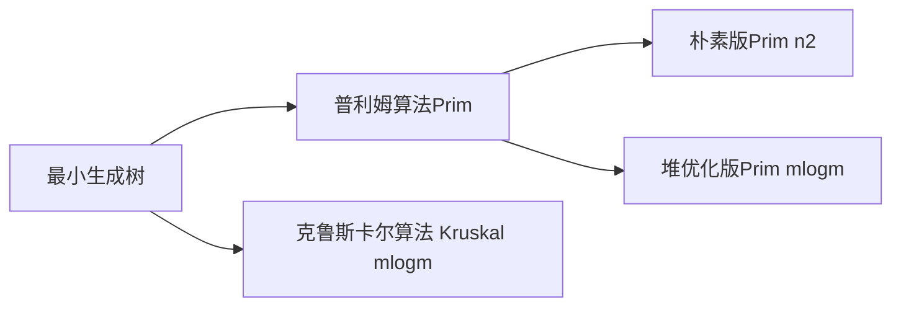

# MST



* 一般稠密图用 朴素版Prim；稀疏图用 Kruskal 算法

## prim 算法

* 一般不用堆优化版Prim

* dijsktra 每次更新找到距离起点最近的点，然后更新其他店到起点的距离；迭代n-1次，起点确定
* prim找到距离集合最近的点，用它更新其他点到集合的距离；迭代n次，一开始没选点
* 因为没有环，因此正权边和负权边都行
* 时间复杂度$O(n^2+m)$

```cpp
int n;
int g[N][N]; // 邻接矩阵，存储所有边
int dist[N]; // 存储其他点到当前最小生成树的距离
bool st[N]; // 存储每个点是否已经在生成树中

// 如果图不联通，则返回INF(值是0x3f3f3f3f),否则返回最小生成树的树边权重之和
int prim() {
    memset(dist, 0x3f, sizeof dist);
    
    int res = 0;
    for (int i = 0; i < n; i++) {
        int t = -1;
        for (int j = 1; j <= n; j++) 
            if (!st[j] && (t == -1 || dist[t] > dist[j]))
                t = j;
        
        if (i && dist[t] == INF) return INF;
        
        if (i) res += dist[t];
        st[t] = true;
        
        for (int j = 1; j <= n; j++) dist[j] = min(dist[j], g[t][j]);
    }
    
    return res;
}
```

## Kruskal算法

* 将所有边按权重从小到打排序（算法的瓶颈）
* 枚举每条边
* 如果两边不连通，将边加到集合中。
* 时间复杂度 $O(mlogm)$ 

```cpp
int n, m;
int p[N]; // 并查集的父节点数组

struct Edge {
    int a, b, w;
    
    bool operator< (const Edge &W) const {
        return w < W.w;
    }
} edges[M]; // 告诉sort函数比较edge中的w属性

int find(int x) {
    if (p[x] != x) p[x] = find(p[x]);
    return p[x];
}

int Kruskal() {
    sort(edges, edges + m);
    for (int i = 1; i <= n; i++) p[i] = i; // 并查集初始化
    
    int res = 0, cnt = 0;
    for (int i = 0; i < m; i++) {
        int a = edge[i].a, b = edge[i].b, w = edge[i].w;
        a = find(a), b = find(b);
        if (a != b) { // 如果两个联通块不连通，则将两个联通快合并
            p[a] = b;
            res += w;
            cnt++;
        }
    }
    
    if (cnt < n - 1) return INF;
    return res;
}
```


# 参考题目

1. [局域网](https://www.acwing.com/problem/content/description/1143/)
2. [连接格点](https://www.acwing.com/problem/content/1146/) 
3. [北极通信网络](https://www.acwing.com/problem/content/description/1147/)
4. [走廊泼水节](https://www.acwing.com/problem/content/348/)
5. [秘密的牛奶运输](https://www.acwing.com/video/540/) 
    

  
    
